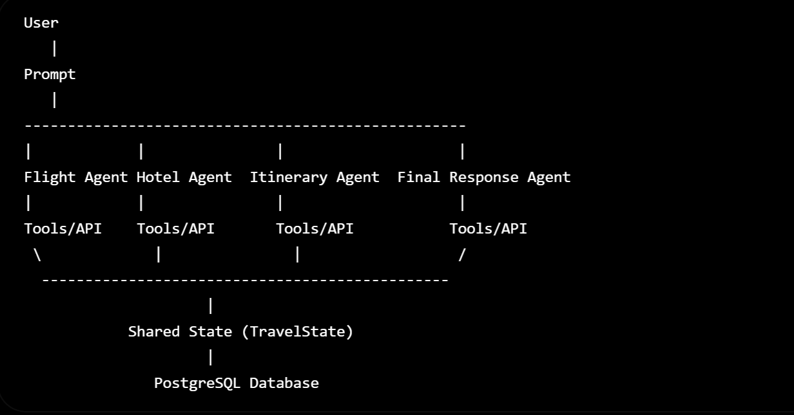
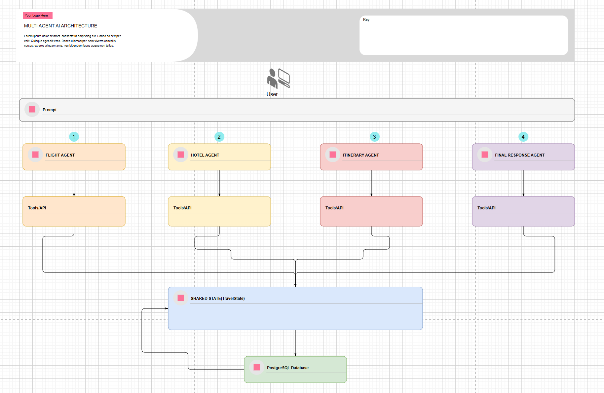

Application URL
https://my-langgraph-application.streamlit.app/

1. Overview

This document describes a Multi-Agent AI Travel Planning System that uses specialized AI agents to process user requests and collaboratively generate complete travel recommendations. Each agent focuses on a specific domain (flight, hotel, itinerary) and shares information through a centralized state layer.

The architecture enables:

Modular AI agents
Independent tool/API integrations
Shared state management
Persistent storage
Scalable orchestration
Structured final response generation

2. Architecture Diagram Components

## 

                     |
            Shared State (TravelState)
                     |
               PostgreSQL Database

3. High-Level Workflow

User submits a travel request.
Request enters the orchestration layer.
Specialized agents execute independently:
Flight Agent
Hotel Agent
Itinerary Agent
Each agent invokes external APIs/tools.
Results are stored inside the shared state object.
Shared state is persisted in PostgreSQL.
Final Response Agent combines outputs.
User receives a unified travel recommendation.

4. Sequence Flow

User
|
v
Prompt
|
+----> Flight Agent -------> Flight API
|
+----> Hotel Agent --------> Hotel API
|
+----> Itinerary Agent ----> Maps API
|
v
Shared State (TravelState)
|
v
PostgreSQL
|
v
Final Response Agent
|
v
User

5. Conclusion
   This architecture implements a multi-agent AI travel planner in which independent domain-specific agents collaborate through a shared state (TravelState) and persistent PostgreSQL storage. The modular design enables scalability, maintainability, and future extensibility while producing a unified travel response for the user.
